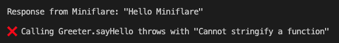

# Miniflare `wrappedBindings` + `getBindings` function stringification error repro

After installing the project's dependencies:
```
$ npm i
```

If you run `npm start` you'll see the following output:


Showing that the `Greeter` wrapped binding can be successfully used inside Miniflare/Workerd but it cannot by the Miniflare binding proxies.
